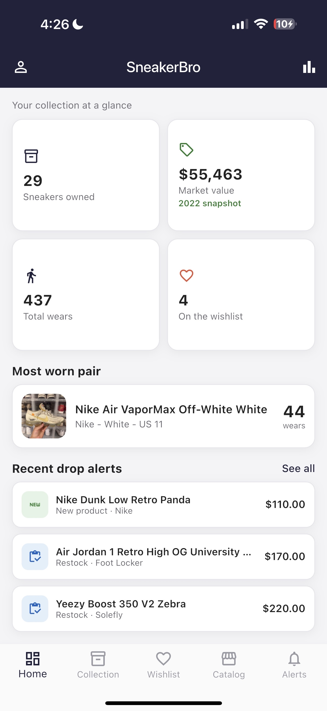
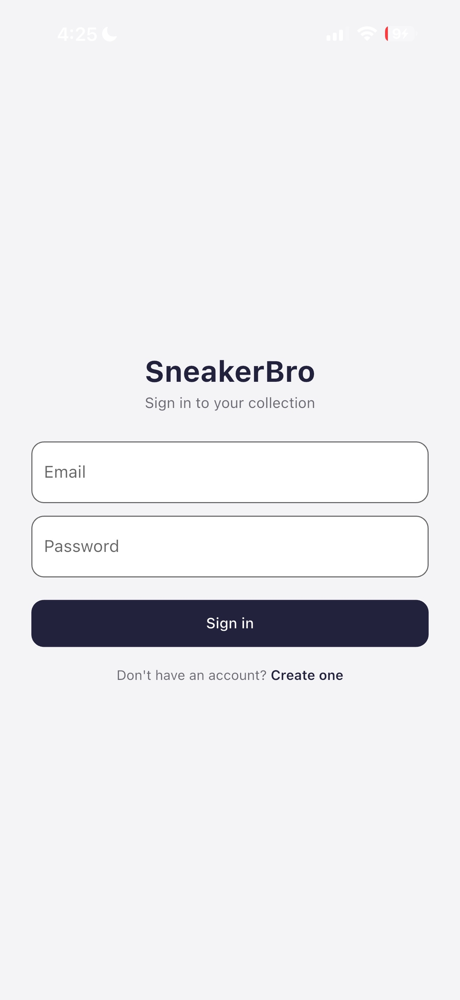
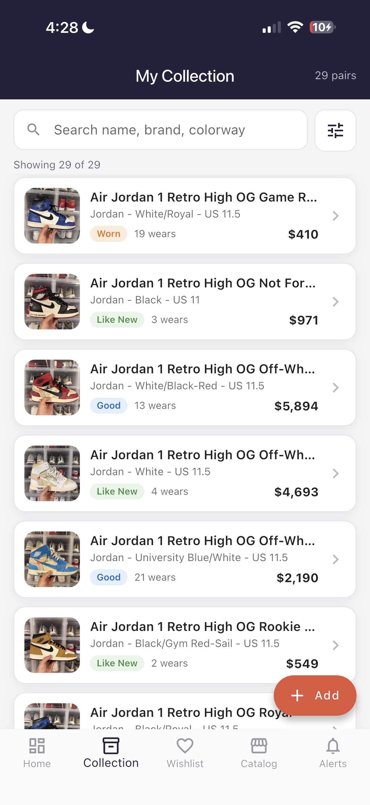
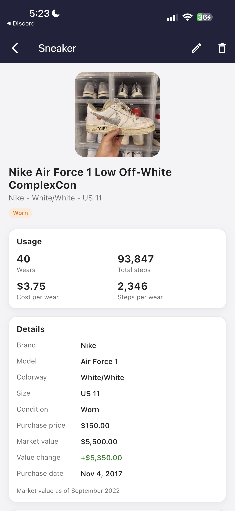
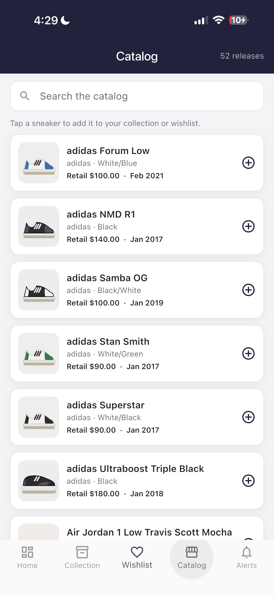
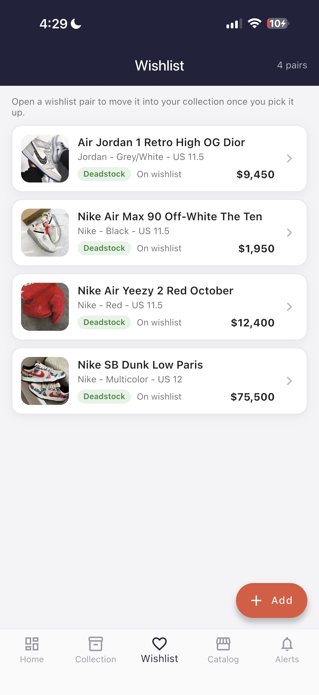
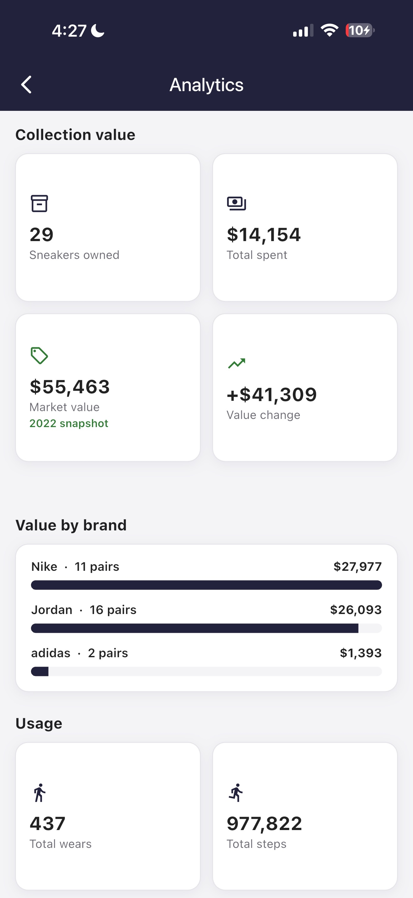
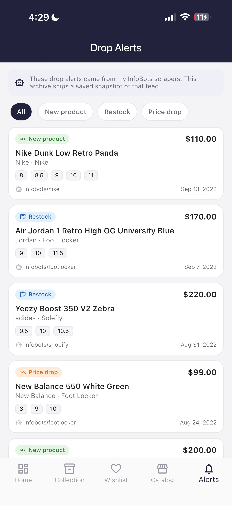
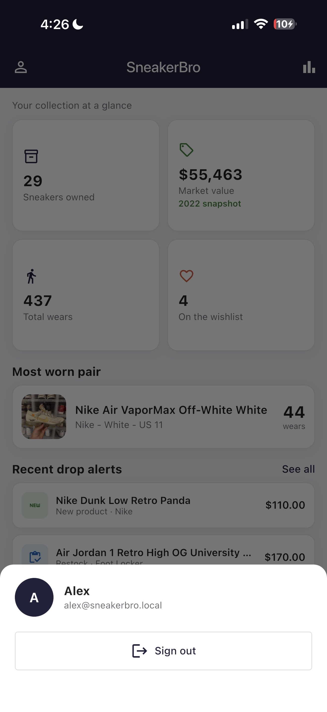

# SneakerBro

> 🗄️ **A re-archived early project.** SneakerBro was one of my first attempts at a real mobile product, originally built between 2018 and 2022. This repository is a cleaned-up, runnable re-archive of that project: the same idea and feature set, rebuilt as a tidy Flutter app so it can be cloned and run today.

**Status:** Re-archived in 2026. The original was a Firebase-backed multi-user app; the backend was retired when the project went quiet in 2022. This repo ships the code with a local stub of the auth and sync layer so it still runs. Not under active development.

SneakerBro is a sneaker collection manager. It helps a collector catalog the pairs they own, track how much they actually wear them, browse a catalog of releases, keep a wishlist, and look through sneaker drop alerts.

<p align="center">
  
</p>

---

## Background

I built **SneakerBro** between 2018 and 2022. It was my first real product. I knew how to code somewhat but had never built a mobile app, so this is where I learned that side of it. My **dad is a software engineer**, and in the early days he sat with me through a lot of it. We set up **Firebase Auth** together (my first real backend work), and he walked me through how to structure a real app. Over time I learned enough to take more of it on myself. The app was a sneaker collection tracker with per-user sync on **Cloud Firestore**, a catalog tab fed by a third-party sneaker API, and a drop-alerts tab pulled from **[InfoBots](https://github.com/alexpicon/infobots)**, my scraper project. Distribution was through **TestFlight**, to friends and to the private Discord server where my InfoBots scrapers ran. They were the same crowd, watching for drops and tracking their collections in one app.

I started college in September 2022 and let it lapse. The Firebase project was retired and the sneaker API disappeared too. A lot of those mid-era sneaker APIs did. This 2026 archive preserves the **code**, snapshots the **API-fed data** (catalog, alerts, 2022 market prices), keeps my own **user data** intact (29-pair collection with my photos, wishlist, wear counts), and ships local stubs of the Firebase layer so the auth flow still runs. Lines marked `// LIVE:` in the source mark where the original made network calls.

---

## Data and provenance

The archive ships three layers: what's yours, what was the API, and the preserved code. Here's what each is and why it looks how it does.

| Layer | What's in it | Status |
|---|---|---|
| **User data** | The owner's 29-pair collection, 4-pair wishlist, photos, wear and step counts, the user account. | Real, preserved. Survives because it was always local to the owner. |
| **API snapshot** | Catalog (52 releases): names, brands, retail, dates ✓. *Images* ✗. Market prices on the collection (2022 deadstock values). Drop alerts (11, last from InfoBots). | What the live API and InfoBots scrapers returned, frozen at retirement and saved to `assets/data/*.json`. Text survived the trip into a public repo; the API's copyrighted product images didn't, so the catalog shows drawn artwork instead. |
| **Code / infra** | The Flutter app itself: screens, widgets, models, state, the auth and storage services. | Code preserved. Live infra (Firebase project, sneaker API) gone. `// LIVE:` comments in `auth_service.dart`, `storage_service.dart`, and `catalog_model.dart` mark every place the original made a network call. |

---

## What it does

SneakerBro is fully functional in the archive build. Sign in (or create an account), and your collection lives under your account:

- **Sign in / sign up.** Per-user accounts, originally backed by Firebase Auth; now a local stub. Each account has its own collection.
- **Collection tracking.** Add, edit, and delete the sneakers you own.
- **Usage tracking.** Log a wear (and optionally the steps walked) on any pair.
- **Cost-per-wear.** See what each pair has really cost you per time worn.
- **Wishlist.** Keep a list of pairs you want, then move them into the collection once you get them.
- **Catalog.** Browse a bundled catalog of releases and add any of them to your collection or wishlist.
- **Drop alerts.** Look through a saved feed of sneaker drop alerts, filtered by type.
- **Analytics.** Total collection value, total spent, value change, total wears and steps, the most-worn pair, and a cost-per-wear leaderboard.
- **Search and filter.** Search the collection by name, brand, or colorway, and filter by brand, condition, and size.

The app ships with sample sneakers, a catalog, and a drop-alert feed, so it looks complete the moment you open it.

---

## Screens

<table>
  <tr>
    <td align="center" width="33%">
      <br>
      <b>Sign in</b><br>
      <sub>Email + password (Firebase Auth stub)</sub>
    </td>
    <td align="center" width="33%">
      <br>
      <b>Dashboard</b><br>
      <sub>Counts, market value, most-worn pair, recent alerts</sub>
    </td>
    <td align="center" width="33%">
      <br>
      <b>Collection</b><br>
      <sub>Owned pairs with photos and 2022 market values</sub>
    </td>
  </tr>
  <tr>
    <td align="center" width="33%">
      <br>
      <b>Sneaker detail</b><br>
      <sub>Per-pair usage, value, condition</sub>
    </td>
    <td align="center" width="33%">
      <br>
      <b>Catalog</b><br>
      <sub>Release catalog with drawn artwork (API images gone)</sub>
    </td>
    <td align="center" width="33%">
      <br>
      <b>Wishlist</b><br>
      <sub>Pairs I'm chasing</sub>
    </td>
  </tr>
  <tr>
    <td align="center" width="33%">
      <br>
      <b>Analytics</b><br>
      <sub>Total value, value by brand, usage stats</sub>
    </td>
    <td align="center" width="33%">
      <br>
      <b>Drop alerts</b><br>
      <sub>Saved InfoBots feed, filterable by type</sub>
    </td>
    <td align="center" width="33%">
      <br>
      <b>Profile</b><br>
      <sub>Account info and sign out</sub>
    </td>
  </tr>
</table>

---

## Tech choices

Two decisions were left open in the original spec. Here is what this re-archive uses and why.

**State management: `provider` with `ChangeNotifier`.** Provider was Google's recommended state-management approach across 2019 to 2021, the period this project comes from, which makes it the historically honest choice. Riverpod existed but matured later and would make the archive feel more modern than it should. The app has two notifiers: `CollectionModel` owns the user's sneakers, and `CatalogModel` holds the read-only catalog and alert data.

**Storage: `hive`, as the local stub for Firestore.** The original stored each user's collection in Cloud Firestore. With the backend retired, the archive needs a local key-value store with the same shape: per-user partitioning, JSON-ish values, fast access. Hive is exactly that: a fast, pure-Dart key-value database widely used in 2020 to 2021. Each sneaker stores as a JSON string keyed by its id, with one box per user (`sneakerbro_collection_<userId>`), mirroring how Firestore partitioned the data. `shared_preferences` would be too thin, `sqflite` would add SQL boilerplate the app doesn't need.

**Auth: a local stub of Firebase Auth.** The original used `firebase_auth`. The stub at `lib/services/auth_service.dart` mirrors the same API surface (`signIn`, `signUp`, `signOut`, a current-user notifier), persists users in Hive, and validates credentials against locally stored values. Lines marked `// LIVE:` mark every place the original made a Firebase call. The goal isn't real security (there is no remote server to defend against); it's preserving the auth flow as an artifact of the original app.

The archive's dependency list is intentionally short: `provider`, `hive`, and `hive_flutter` for state and storage, plus `image_picker` and `path_provider` for the camera/library picker. The original ran `firebase_auth` and `cloud_firestore` on top of these; both are gone with the backend, replaced by the local stubs in `lib/services/`.

---

## Data model

**Sneaker** (owned pairs and wishlist entries)

```
id, name, brand, model, colorway, size, condition,
purchasePrice, estimatedValue, purchaseDate, imageUrl,
totalSteps, wearCount, notes, isWishlist
```

**DropAlert** (a saved InfoBots alert)

```
id, productName, brand, store, price, sizes, url,
timestamp, sourceBot, alertType (new_product | restock | price_drop)
```

**CatalogItem** (a browsable release)

```
id, name, brand, model, colorway, retailPrice, imageUrl, releaseDate
```

---

## Running it

You need the [Flutter SDK](https://docs.flutter.dev/get-started/install) installed.

This repository contains the app source (`lib/`, `assets/`, `pubspec.yaml`). The platform runner folders (`android/`, `ios/`, `web/`) are not committed, so the first step generates them:

```bash
cd sneakerbro

# Generate the platform folders for an existing project.
flutter create --platforms=android,ios,web .

# Fetch the dependencies.
flutter pub get

# Run it on a connected device, simulator, or Chrome.
flutter run
```

The app opens to a sign-in screen. A **demo account** ships with the bundled collection:

- email: `alex@sneakerbro.local`
- password: `archive`

Sign in with those to see the full archive. Tap **Create one** to register your own account instead. You'll start with an empty collection, since per-user storage is preserved end to end.

On iOS, the photo picker needs two usage strings in `ios/Runner/Info.plist`: `NSCameraUsageDescription` and `NSPhotoLibraryUsageDescription`. They are
already set; if you regenerate the platform folders, re-add them or the app
will crash when you open the camera or photo library.

To run the tests:

```bash
flutter test
```

---

## Project structure

```
sneakerbro/
├── lib/
│   ├── main.dart              app entry, providers, auth-gated routing
│   ├── theme.dart             colours and the app theme
│   ├── models/                Sneaker, DropAlert, CatalogItem, AppUser
│   ├── services/              auth and storage stubs (originally Firebase), photo picker, asset loading
│   ├── state/                 CollectionModel and CatalogModel notifiers
│   ├── screens/               the app screens (sign in, sign up, dashboard, collection, wishlist, catalog, alerts, detail, analytics, add/edit)
│   ├── widgets/               shared UI pieces
│   └── utils/                 parsing, formatting, search helpers
├── assets/
│   ├── data/                  bundled catalog, alerts, and sample sneakers
│   └── photos/                bundled photographs of the owner's collection
└── test/                      unit tests for the metrics and search
```

---

## License

MIT. See [LICENSE](LICENSE).

---

Built with Flutter. Part of my early builder archive, alongside [InfoBots](https://github.com/alexpicon/infobots).
